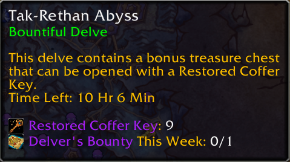

# WeeklyDelveMaps

> Show your acquired Delver's Bounty maps on tooltip of the Delve Entrances

WeeklyDelveMaps simplifies tracking your weekly Delver's Bounty maps by displaying your progress (x/1) directly on tooltips for all Delve Entrances. The addon automatically checks your collected maps and integrates the count seamlessly into the tooltips ensuring you never lose track of your progress toward the weekly cap. Just hover a Delve Entrace in world map to see if you’ve got the bounty map.
