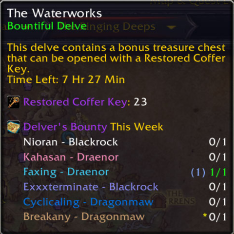

# WeeklyDelveMaps

> Show your acquired Delver's Bounty maps on tooltip of the Delve Entrances

**There are three parts to the status text, from right to left:**

1. The `'x/1'` weekly map loot status:
    - If x = 1, it means you have already looted a map this week and cannot loot another.
    - If x = 0, you are eligible to loot a new map. However, if it shows in red, it means you already have one map in your bag. Since maps are unique, you won't be able to loot another even though you are eligible.
2. The map buff status, shown as a yellow `'*'`:
    - This appears when the character has used the map and has an active buff but has not opened the chest yet.
3. The map in bag indicator, shown as `'(1)'` in blue:
    - This means the character has a map in their bag that has not been used yet.
    
WeeklyDelveMaps simplifies tracking your weekly Delver's Bounty maps by displaying your progress (x/1) directly on tooltips for all Delve Entrances. The addon automatically checks your collected maps and integrates the count seamlessly into the tooltips ensuring you never lose track of your progress toward the weekly cap. Just hover a Delve Entrace in world map to see if you’ve got the bounty map.
